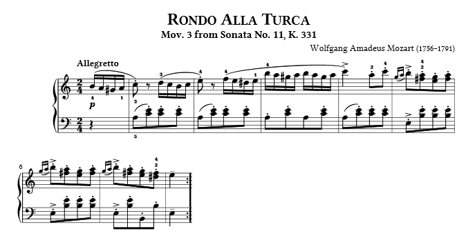

# Simue

The Simue is a simplified music notation languge.

## Notation Examples
Here is how first 9 bars of Mozart's Alla Turca from Piano Sonata № 11 look like in the Simue language.

Music score:



The Simue:
````
temp120 b4-16 a4-16 g#4-16 a4-16 c5-8 p-8 d5-16 c5-16 b4-16 c5-16 e5-8 p-8 f5-16 e5-16 d#5-16 e5-16 b5-16 a5-16 g#5-16 a5-16 b5-16 a5-16 g#5-16 a5-16 c6-4 a5-8 c6-8 g5-64 a5-64 b5-16 a5-8 g5-8 a5-8 g5-64 a5-64 b5-16 a5-8 g5-8 a5-8 g5-64 a5-64 b5-16 a5-8 g5-8 f#5-8 e5-4
````
## Usage Examples
To compile music in Simue use this code:
```csharp
SimueCompiler compiler = new SimueCompiler();
string allaTurca = "temp120 b4-16 a4-16 g#4-16 a4-16 c5-8 p-8 d5-16 c5-16 b4-16 c5-16 e5-8 p-8 f5-16 e5-16 d#5-16 e5-16 b5-16 a5-16 g#5-16 a5-16 b5-16 a5-16 g#5-16 a5-16 c6-4 a5-8 c6-8 g5-64 a5-64 b5-16 a5-8 g5-8 a5-8 g5-64 a5-64 b5-16 a5-8 g5-8 a5-8 g5-64 a5-64 b5-16 a5-8 g5-8 f#5-8 e5-4";
var result = compiler.Parse(compiler.Tokenize(allaTurca));
```
You’ll get a `CompilationResult` object in which you find a `Song` object that contains an array of `Note` struct. `Note` struct is basically a pair of numbers (frequency and duration of a sound) that you can use to represent a primitive sound wave.
If you'd use any library that can generate primitive sounds using frequency and duration values, you could hear [this](alla-turca.mp3).
## Wiki
Coming soon.
